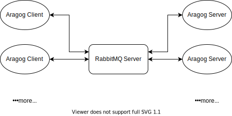

# Aragog

Aragog 是一个双模式的分布式爬虫框架

## 系统架构

使用 RabbitMQ 实现分布式架构, 可以部署多个爬虫服务端, 消耗同一个任务队列, 实现任务的负载均衡



## 特性

- **分布式架构:** 使用 RabbitMQ 处理任务队列, 灵活的服务扩展和并发控制
- **双运行模式:** 可使用普通 HTTP 请求或无头浏览器执行爬虫任务, 在性能和兼容性上取得平衡
- **多功能:** 支持自定义用户脚本、POST 请求方式、HTTP 认证、设置请求头、获取响应头等功能
- **提供客户端:** 提供 Node.js 客户端, 方便在其他项目中使用
- **服务端部署方便:** 使用 Docker 方式进行部署, 一键安装

## 客户端

具体说明请查看 [客户端文档](client/README.md)

## 部署

1. 开发环境需安装 node 与 yarn
1. 克隆此仓库
1. 安装依赖

   ```bash
     yarn install
   ```

1. 编译源代码

   ```bash
     yarn build
   ```

   编译成功后, 编译后的代码保存 dist 目录, 可以直接使用 node 执行

1. 运行服务

   1. Docker 方式 (推荐)

      1. 一键拷贝相关文件到 Docker 目录

         ```bash
           yarn initdocker
         ```

      1. 根据实际情况分别修改 aragog-server 和 rabbitmq 文件夹中的 docker-compose.yml (如网络配置、rabbitmq 用户名密码等)
      1. 将修改后的 docker 目录拷贝到服务器上, 在 docker-compose.yml 所在的目录中分别运行 `docker-compose up -d` 启动服务 (先启动 rabbitmq 服务)
      1. 初次运行后会在 data 目录中生成配置文件, 可编辑配置文件后重新启动

   1. 直接运行

      1. 服务器需安装 [NodeJS][nodejs-download]、[Yarn][yarn-download]、[RabbitMQ][rabbitmq-download]
      1. 在服务端新建一个空目录存放代码 (如 aragog-server)
      1. 拷贝 package.json、yarn.lock 和 dist 目录到 aragog-server
      1. 进入 aragog-server 目录并安装依赖

         ```bash
           yarn install --prod --registry https://registry.npm.taobao.org/ # 可选淘宝源
         ```

      1. 在 aragog-server 目录中运行 `yarn server` 或 `node dist/main.js` 启动服务
      1. 初次运行后会在 data 目录中生成配置文件, 可编辑配置文件后重新启动

## 配置文件

启动服务后, 如果不存在配置文件, 则会在 data 目录下生成初始配置文件
如未指定相应配置字段, 将使用如下配置

```json
{
  "amqp": {
    "server": {
      // RabbitMQ 服务器配置
      "hostname": "localhost",
      "port": 5672,
      "username": "guest",
      "password": "guest",
      "vhost": "/"
    },
    // 无头浏览器模式, 任务消息队列配置
    "headlessQueue": {
      "queue": "headless",
      "exchange": "aragog_exchange",
      "prefetch": 5 // 最大并发处理数量
    },
    // HTTP请求模式, 任务消息队列配置
    "sourceQueue": {
      "queue": "source",
      "exchange": "aragog_exchange",
      "prefetch": 5
    }
  },
  // 服务端日志配置
  "log": {
    "debugMode": false, // 是否开启调试模式 (包含更多日志, 如请求信息和客户端参数等)
    // AMQP协议日志
    "amqp": {
      "maxSize": 5120, // 单个日志文件大小 (MB)
      "backups": 5 // 备份数量
    },
    // 错误日志
    "error": {
      "maxSize": 5120,
      "backups": 5
    },
    // 无头浏览器模式日志
    "headless": {
      "maxSize": 5120,
      "backups": 5
    },
    // HTTP请求模式日志
    "source": {
      "maxSize": 5120,
      "backups": 5
    }
  },
  // 无头浏览器模式爬虫相关配置
  "headless": {
    "headless": true, // 是否隐藏浏览器界面 (调试时可以选择 false, 方便查看运行过程)
    "ignoreHTTPSErrors": false, // 是否忽略 https 证书错误
    "browserCloseTimeout": 300, // 无任务时浏览器超时关闭时间 (单位: 秒, 无新任务时开始计时, 可清理无响应的标签)
    "defaultLoadTimeout": 60, // 每个任务的页面加载超时时间 (单位: 秒, 加载超时, 则任务出错)
    "retries": 2, // 加载错误重试次数 (不包含响应状态码错误)
    // 自定义请求时的 userAgent
    "userAgent": "Mozilla/5.0 (Macintosh; Intel Mac OS X 10_15_4) AppleWebKit/537.36 (KHTML, like Gecko) Chrome/81.0.4044.138 Safari/537.36"
  },
  // HTTP请求模式爬虫相关配置
  "source": {
    "defaultLoadTimeout": 30,
    "retries": 2,
    "userAgent": "Mozilla/5.0 (Macintosh; Intel Mac OS X 10_15_4) AppleWebKit/537.36 (KHTML, like Gecko) Chrome/81.0.4044.138 Safari/537.36"
  }
}
```

## 测试

测试前需要先启动 RabbitMQ 服务, 默认连接到如下服务器

```json
{
  "hostname": "localhost",
  "username": "test",
  "password": "test",
  "vhost": "/"
}
```

可在 `test/utils/amqp.ts` 文件中更改默认服务器配置

使用 `yarn install` 安装依赖, 然后运行 `yarn test` 开始测试

## 许可证

MIT

[nodejs-download]: https://nodejs.org/en/download
[yarn-download]: https://classic.yarnpkg.com/en/docs/install
[rabbitmq-download]: https://www.rabbitmq.com/download.html
